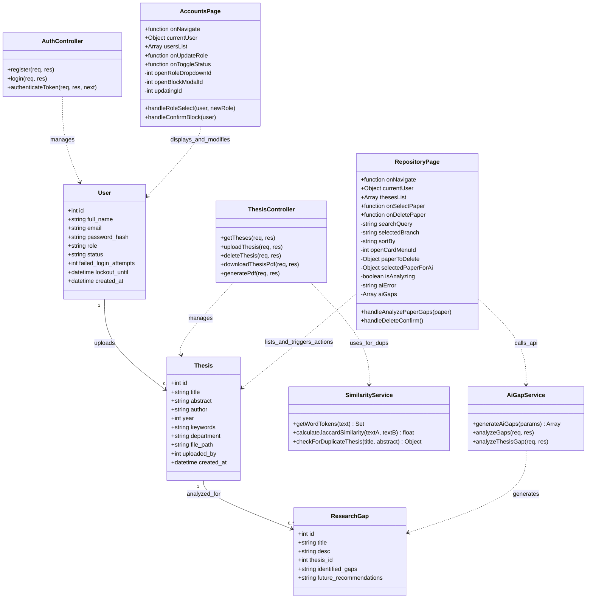

### Summary of SIYASAT Class Design
* **Model Schemas & Multiplicity**: Establishes strong relations between the `User` and `Thesis` (1 to 0..*), as well as a `Thesis` and its generated `ResearchGap` (1 to 0..*).
* **Core Controllers & Services**: Employs an `AuthController` for credential validation and token-based middleware, a `ThesisController` delegating to a `SimilarityService` (using token-based Jaccard similarity to prevent duplicate submissions), and an `AiGapService` invoking the Groq Llama API for research gap analysis.
* **Component-Level React State**: Maps detailed UI properties, callback props (`onUpdateRole`, `onToggleStatus`), and local component state (like modals, dropdowns, and search queries) within both the `AccountsPage` and `RepositoryPage` files.
